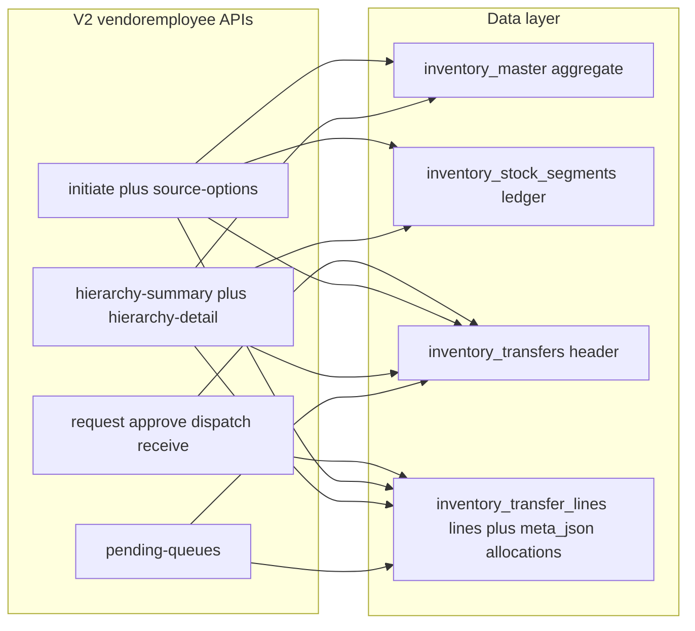

# API Implementation Status (Hierarchy Inventory)

This file summarizes:
- what is already implemented at API level
- how much of your requested plan is completed
- what is still left

## Working Memory (Use This First)

Use this section as the canonical session memory before touching code.

**Frontend integration (screens, APIs, role visibility):** see [`frontend_hierarchy_integration_ui_flow.md`](frontend_hierarchy_integration_ui_flow.md).

### Current operating rules

- Segment ledger is source-of-truth for movement: `inventory_stock_segments`.
- `inventory_master` is aggregate summary (synced totals), not batch ledger.
- Dispatch must be selector-driven; no silent cross-bucket fallback.
- Batch/expiry aware flows must stay FEFO and exclude expired stock.
- For franchise hierarchy push issues, prefer fixing `FranchiseApiController` linkage/sync paths before touching order deduction logic.

### Important endpoints in active use

- `POST /vendoremployee/inventory-transfer/initiate` (direct dispatch; strict `source_selector`)
- `POST /vendoremployee/inventory-transfer/source-options` (segments + filter buckets for UI)
- `POST /vendoremployee/inventory-transfer/request` (child requests stock from parent)
- `POST /vendoremployee/inventory-transfer/approve/{id}` / `dispatch/{id}` / `receive/{id}` (request pipeline)
- `POST /vendoremployee/inventory-transfer/hierarchy-summary` (store list + day/range transfer rollups by `store_type`)
- `POST /vendoremployee/inventory-transfer/hierarchy-detail` (one store: stock + optional batches + transactions)
- `POST /vendoremployee/inventory-transfer/hierarchy-report` (backward-compatible alias: same handler as **detail**)
- `POST /vendoremployee/inventory-transfer/pending-queues` (approve/receive/my-request queues for current restaurant)
- `POST /vendoremployee/franchise/push/{id}`
- `POST /vendoremployee/inventory/add-stock/{id}`

### How this area is structured (canonical)



- **Reporting** reads aggregates + transfer joins; it does not move stock.
- **Transfers** mutate stock via `InventoryHierarchyTransferService` (segments + master sync).
- **Hierarchy reporting** scopes visible restaurants in `InventoryTransferApiController` (`getAccessibleChildRestaurants`): master sees all centrals and their franchises; central sees self, own franchises, sibling centrals, and sibling franchises; franchise sees only self (detail `store_restaurant_id` must be self; transactions incoming-only for franchise actor).

### What has been solved (with method)

1) **Destination segment lineage missing**
- Problem: `source_restaurant_id`/`origin_transfer_id` not reliably captured on receive.
- Fix: receive path now passes sender restaurant and transfer id into destination segment upsert; insert/update fills lineage fields.

2) **Repeated receives merged under first transfer id**
- Problem: same batch/expiry receive updates old row and keeps old `origin_transfer_id`.
- Fix: destination segment upsert key includes `origin_transfer_id` so each transfer gets its own segment row.

3) **Legacy dispatch ambiguity**
- Problem: segment with missing batch/expiry could be dispatched via direct segment selection.
- Fix: `LEGACY_SELECTOR_REQUIRED` guard introduced for segment mode on legacy rows; explicit non-batch selector path required.

4) **Backdated expiry accepted in add-stock**
- Problem: add-stock allowed past/today expiry.
- Fix: add-stock validator changed to `expiry_date: nullable|date|after:today` with clear message.

5) **Unit case issue in add-stock (`Kg` vs `kg`)**
- Problem: mixed-case unit could under-credit quantity.
- Fix: add-stock conversion normalizes request unit using lowercase trim before comparisons.

6) **Franchise push broke consumption linkage**
- Problem: after push/repush, recipe/addon/food links could drift; consumption then skipped.
- Fixes:
  - Added persistent mapping table: `central_push_entity_map` (source->target IDs).
  - Mapping resolution is mapping-first, then one-time name fallback persisted back to map.
  - Push now reconciles both `add_ons.recipe_id` and `recipes.addon_id` plus `food.recipe_id`.
  - Added `stock_item` module sync in push bundle:
    - first insert initializes quantity fields to `0`
    - repush preserves existing child quantity values.

### Known behavior to remember

- `manage_stock()` skips deduction when `recipe_id` is missing; linkage integrity is critical.
- Negative stock deduction is allowed by current runtime behavior and is observed in logs.
- Push response diagnostics (`_diagnostics.link_repair`) are key for verifying linkage repairs.
- Add-on deduction precondition: `add_ons.has_inventory` must be `yes` (case-insensitive check in order flow). If it is off/no, addon stock deduction is skipped by design.
- Incident note (resolved): add-on deduction appeared broken but root cause was `has_inventory` disabled on the add-on; once enabled, deduction worked.

### Fast debug checklist (when issue repeats)

1. Run franchise push and inspect diagnostics:
- `results._diagnostics.link_repair`

2. Verify mapping health:
- `central_push_entity_map` has rows for `recipes`, `add_ons`, `food`, `inventory_master`.

3. Verify child linkage consistency:
- `food.recipe_id`
- `add_ons.recipe_id`
- `recipes.addon_id`

4. Verify deduction logs:
- look for `MANAGE_STOCK [food]` and `MANAGE_STOCK [addon]` entries in `storage/logs/laravel.log`.

## Segment Ledger Upgrade (Latest)

- New ledger table: `inventory_stock_segments` (source-of-truth for mutable stock movement).
- `inventory_master` remains compatibility aggregate and is recalculated from segment sums during transfer mutations.
- Transfer line allocations are stored in `inventory_transfer_lines.meta_json` under `segments`.
- Dispatch uses FEFO (`expiry_date` non-null first, ascending; null expiry last; FIFO fallback by `created_at`).
- Expired segments are excluded from dispatch; if only expired stock is available, service raises `STOCK_EXPIRED`.
- Idempotency guards:
  - `dispatch` on already `dispatched` request transfer -> `ALREADY_PROCESSED`
  - `receive` on `received` / cancelled / rejected transfer -> `ALREADY_PROCESSED`
  - `cancel/reject` on terminal transfer -> `ALREADY_PROCESSED`
- Receive supports incremental processing using line progress state in `meta_json` (`pending_qty`, `received_qty`, `rejected_qty`) and line statuses `pending|partially_received|received`.

## Latest Updates (Current Session)

- Direct dispatch validation now supports `master -> franchise` when the franchise belongs to the master (directly or via its central parent).
- New endpoint added: `POST /inventory-transfer/source-options`.
  - Reads source buckets from `inventory_stock_segments`.
  - Returns `segments`, `distinct_batches`, `distinct_expiry_dates`, and filter summaries.
  - Filter summaries are mutually exclusive (no duplicate quantity counting):
    - `without_batch_and_expiry`
    - `without_batch_only`
    - `without_expiry_only`
    - `with_batch_and_expiry`
  - Includes `is_fallback` and per-row `source_mode`.
  - If segments are empty but `inventory_master.cal_quantity > 0`, API returns one synthetic fallback row (`batch=null`, `expiry_date=null`) from `inventory_master`.
- Dispatch/request/edit now require strict selector payload per line:
  - `source_selector.mode`: `segment_id` or `filter_bucket`
  - `segment_id` mode requires `source_selector.segment_id`
  - `filter_bucket` mode requires:
    - `bucket` (`without_batch_and_expiry|without_batch_only|without_expiry_only|with_batch_and_expiry`)
    - `batch_state` and `expiry_state` (`null|value|any`)
    - `batch`/`expiry_date` when state=`value`
  - Missing/invalid selectors fail with explicit errors (`MISSING_SOURCE_SELECTOR`, `INVALID_SOURCE_SELECTOR`).
- Selector-constrained allocation is enforced:
  - FEFO applies only inside selected subset
  - no fallback to other buckets
  - selector mismatch errors: `SEGMENT_SELECTOR_NOT_FOUND`, `SELECTED_BUCKET_STOCK_NOT_FOUND`, `SELECTOR_STOCK_MISMATCH`.
- Segment reconciliation fix applied for mixed legacy+segmented stock:
  - `seedSegmentsForInventoryItem()` no longer exits early when any segment exists for item/unit.
  - It now reconciles per `inventory_master_id` and inserts only missing remainder (`inventory_master.cal_quantity - segment_sum`) so selector buckets are dispatchable.
- Destination aggregate uniqueness fix applied:
  - destination `inventory_master` credit/upsert now uses unique key (`restaurant_id`, `stock_title`, `unit_id`) only.
  - batch/expiry is no longer used to split destination aggregate rows.
  - batch-level tracking remains in `inventory_stock_segments` only.
  - concurrency guard added (lock + re-read after insert) to reduce duplicate row creation during parallel receives.
- Source-options remainder visibility fixed:
  - when `inventory_master` total is greater than segment total, API appends synthetic `inventory_master_remainder` row (`batch=null`, `expiry_date=null`) so frontend sees full available stock.
- `addStockById` upgraded for batch/expiry + lineage (backward compatible):
  - accepts optional `batch`, `expiry_date`
  - writes/upserts `inventory_stock_segments` rows
  - keeps old `inventory_master` update path intact
  - accepts optional `source_restaurant_id` (default: current restaurant)
  - accepts optional `origin_transfer_id` (default: `null`)
  - segment upsert matching includes lineage fields so differently-originated stock does not merge unintentionally.
- Unit conversion bug fix applied (runtime-verified):
  - dispatch conversion now correctly handles cross-unit request where input is `kg/ltr` but source unit metadata base is `gm/ml`.
  - Example fixed: Butter `1 kg` now converts to `1000 cal` (not `1 cal`) and deducts correctly.

## Latest Hotfixes (Post Session)

- Destination segment lineage + per-transfer rowing finalized:
  - receive path now threads `from_restaurant_id` into destination segment upsert.
  - destination `inventory_stock_segments.source_restaurant_id` is set from sender restaurant (and backfilled on update when missing).
  - destination segment upsert key now includes `origin_transfer_id` (when available), so repeated receives for same batch/expiry create separate rows per transfer id instead of reusing first transfer row.
  - `inventory_master` remains aggregate-only and still syncs by summing all segments for that item key.
- Legacy selector dispatch guard added:
  - selecting a segment with `source_selector.mode=segment_id` now fails with `LEGACY_SELECTOR_REQUIRED` when that segment has missing `batch` or `expiry_date`.
  - intended behavior: legacy/missing batch-expiry stock must be dispatched through explicit non-batch filter-bucket selector path.
  - API exception mapping added with clear message and `422` response.
- Add-stock expiry policy tightened (vendoremployee add-stock endpoint):
  - validation changed from `nullable|date` to `nullable|date|after:today` (future-only).
  - backdated and same-day expiry are now rejected.
- Add-stock unit normalization fix:
  - add-stock conversion logic now normalizes request unit with lowercase trim before comparisons.
  - case variants like `Kg`/`KG` now behave the same as `kg` and no longer under-credit display quantity.

## Franchise Push Linkage Fix (Latest)

- `POST /vendoremployee/franchise/push/{id}` updated to preserve consumption linkage after push.
- New persistent mapping table added: `central_push_entity_map` (source->target id mapping by parent+child+module).
- Mapping resolution now uses mapping table first; name fallback is used only when mapping is missing, then mapping is persisted.
- Push now includes `stock_item` sync in bundle mode:
  - first insert initializes quantity fields to zero
  - repush preserves existing child `stock_quantity` and `calculate_quantity` while updating links/metadata
- Post-push linkage repair now includes `food.recipe_id` alignment in addition to addon-recipe pointer repair.
- Result diagnostics now include `fixed_food_recipe_id` under `results._diagnostics.link_repair`.
- This addresses the case where `manage_stock()` skipped deduction due to null `recipe_id` after push.

## Hierarchy inventory reporting (summary + detail)

All routes below are under vendoremployee v2 prefix: `/api/v2/vendoremployee/inventory-transfer/...`.

### Endpoints and roles

| Endpoint | Purpose |
|----------|---------|
| `POST .../hierarchy-summary` | List visible stores filtered by `store_type` (`central` \| `franchise`) with per-store transfer rollups for the date window. |
| `POST .../hierarchy-detail` | One store: full stock summary for that store, optional batch drilldown + parent batches for dispatch context, and line-level transactions. |
| `POST .../hierarchy-report` | **Backward compatible:** delegates to the same logic as **hierarchy-detail** (pass `store_restaurant_id` as for detail). Prefer **summary** + **detail** in new UI. |

### Visibility (must match controller)

- **Master:** all centrals under master + all franchises under those centrals (master's own row is not in the "children" list but is in scope for detail parent batches via actor id).
- **Central:** self + own franchises + sibling centrals (same master parent) + sibling centrals' franchises.
- **Franchise:** only self. `store_restaurant_id` must be the franchise. Transaction queries for franchise actor are **incoming only** (`to_restaurant_id = actor`).

Out-of-scope `store_restaurant_id` -> `403` unauthorized-style error from controller.

### `hierarchy-summary` contract

- **Body:** `store_type` required (`central` \| `franchise`); optional `from_date`, `to_date` (`Y-m-d`).
- **Date default:** if neither `from_date` nor `to_date` is sent, rollups use **today** only (same rule as transaction queries elsewhere).
- **Franchise actor:** the summary aggregate query applies an **incoming-only** filter (`to_restaurant_id = actor`), consistent with franchise transaction visibility; master/central actors see both directions within scoped transfers.
- **Response `data.stores`:** each row: `restaurant_id`, `restaurant_name`, `restaurant_type`, `sent_quantity`, `received_quantity`, `transaction_count` (from `inventory_transfers` + `inventory_transfer_lines`, scoped to visible restaurant set and date window).

### `hierarchy-detail` contract

- **Body:** `store_restaurant_id` **required**; optional `selected_stock_title`, `selected_unit_id` (both required together for batch sections); optional `transactions_stock_title`; optional `from_date`, `to_date`.
- **Response `data`:** `restaurants` (visible list for picker), `store_restaurant_id`, `child_stock_summary` (always for that store), `child_stock_batches` (non-empty only when stock+unit selected), `parent_stock_batches` (actor's batches for same stock when selected), `transactions` (for `store_restaurant_id`; default today; optional stock title filter).
- **Stock summary:** from `inventory_master`; low-stock uses normalized min alert (kg/ltr -> x1000 base); sorted low-stock first.
- **Batches:** from `inventory_stock_segments`; expired excluded; FEFO ordering for display.

### Dispatch (unchanged)

- UI still dispatches via `POST /inventory-transfer/initiate` with mandatory `source_selector.mode=segment_id` and `segment_id` (no silent FEFO fallback).

## Pending transfer queues (read-only index)

- **Endpoint:** `POST /inventory-transfer/pending-queues`
- **Body:** optional `limit` (1-200, default 50).
- **Context:** uses authenticated vendor employee's `restaurant_id` as the actor restaurant (no impersonation of other stores).
- **Response `data`:**
  - `approval_pending`: transfers with `status = requested` where `from_restaurant_id = actor` (parent/source can approve).
  - `receive_pending`: transfers with `status = dispatched` where `to_restaurant_id = actor` (destination can receive).
  - `my_requests`: transfers where `to_restaurant_id = actor` and `status` in `requested`, `approved`, `dispatched` (requester's pipeline visibility).
  - `actions`: template paths for `approve/{id}` and `receive/{id}` under the same v2 prefix.
- **Mutations:** not done here; use existing `approve`, `dispatch`, `receive`, `reject`, `cancel`, `edit` endpoints per transfer flow table below.

## Transfer Flow Table

| Step | Endpoint | Allowed actor restaurant | Valid input status | Resulting status | Stock movement |
|------|----------|--------------------------|--------------------|------------------|----------------|
| Request | `POST /inventory-transfer/request` | requester (`franchise` or `central`) | n/a (new) | `requested` | none |
| Approve | `POST /inventory-transfer/approve/{id}` | source/parent (`from_restaurant_id`) | `requested` | `approved` | none |
| Dispatch (request flow) | `POST /inventory-transfer/dispatch/{id}` | source/parent (`from_restaurant_id`) | `approved` | `dispatched` | source debit |
| Dispatch (direct compatibility) | `POST /inventory-transfer/initiate` | source (`from_restaurant_id`) | n/a (new) | `dispatched` | source debit |
| Receive | `POST /inventory-transfer/receive/{id}` | destination (`to_restaurant_id`) | `dispatched` | `received` | destination credit |
| Cancel | `POST /inventory-transfer/cancel/{id}` | source (`from_restaurant_id`) | `dispatched` | `cancelled` | source restore |
| Reject (pre-dispatch) | `POST /inventory-transfer/reject/{id}` | source/parent (`from_restaurant_id`) | `requested` or `approved` | `rejected` | none |
| Reject (post-dispatch) | `POST /inventory-transfer/reject/{id}` | destination (`to_restaurant_id`) | `dispatched` | `rejected` | source restore |
| Edit request (pre-dispatch) | `POST /inventory-transfer/edit/{id}` | source/parent (`from_restaurant_id`) | `requested` or `approved` | `requested` | none |
| Pending queues (read-only) | `POST /inventory-transfer/pending-queues` | authenticated restaurant | n/a | n/a | none |

## Cancel/Reject Caller Matrix

| Endpoint | Current transfer status | Who can call | Restaurant side |
|----------|--------------------------|--------------|-----------------|
| `POST /inventory-transfer/cancel/{id}` | `dispatched` | sender/source employee | `from_restaurant_id` |
| `POST /inventory-transfer/reject/{id}` | `requested` | parent/source employee | `from_restaurant_id` |
| `POST /inventory-transfer/reject/{id}` | `approved` | parent/source employee | `from_restaurant_id` |
| `POST /inventory-transfer/reject/{id}` | `dispatched` | receiver/destination employee | `to_restaurant_id` |

## Resolution Type Matrix (Cancel/Reject/Receive)

| `resolution_type` | Cancel/Reject effect | Receive with rejected qty effect | Transfer final status |
|---|---|---|---|
| `return_to_source` (default) | restore rejected/cancelled qty to source | rejected qty restored to source | `cancelled` / `rejected` / `partially_received` |
| `damaged` | do not restore stock | rejected qty marked as damaged (no restore) | `cancelled` / `rejected` / `partially_received` |
| `partial_return` | restore only `returned_qty`; rest damaged | same split for each rejected line | `cancelled` / `rejected` / `partially_received` |
| `in_transit_hold` | no stock movement | no restore for rejected qty | `on_hold` |

## Payload Catalog (All Supported Variants)

### Cancel/Reject payload (optional fields)

```json
{
  "resolution_type": "return_to_source|damaged|partial_return|in_transit_hold",
  "resolution_meta": {
    "reason": "optional note",
    "returned_qty": 1.5,
    "returned_lines": {
      "123": 0.5,
      "124": 1.0
    }
  }
}
```

Notes:
- if payload is empty, system defaults to `return_to_source` (backward-compatible)
- `returned_qty` / `returned_lines` are only used for `partial_return`

### Receive payload (full receive + partial receive)

```json
{
  "resolution_type": "return_to_source|damaged|partial_return|in_transit_hold",
  "resolution_meta": {
    "reason": "optional note",
    "returned_qty": 0.5,
    "returned_lines": {
      "123": 0.2
    }
  },
  "received_lines": [
    {
      "line_id": 123,
      "accepted_qty": 9,
      "rejected_qty": 1
    },
    {
      "line_id": 124,
      "accepted_qty": 5,
      "rejected_qty": 0
    }
  ]
}
```

Rules:
- per line: `accepted_qty + rejected_qty == requested_qty`
- if `received_lines` is omitted, behavior is full receive (existing flow)
- cannot receive if transfer is not currently `dispatched`

## Why Edit Moves Back To Requested

- `edit/{id}` intentionally resets an `approved` transfer back to `requested`.
- Reason: approval is considered a sign-off on exact lines/quantities; once edited, prior approval is invalid.
- This enforces a second approval before dispatch and prevents dispatching unapproved edits.
- It is also fully auditable: `request_edited` event is written with updated line snapshot.

## Audit/Event Coverage

Events written to `inventory_transfer_events` (when table exists):
- `request_created`
- `approved`
- `request_edited`
- `dispatched`
- `received`
- `cancelled`
- `rejected`
- `on_hold`

Each event includes actor and line snapshot (`meta_json.lines`), plus resolution metadata where applicable.

## Completed

- Core transfer stack is implemented:
  - `InventoryHierarchyTransferService`
  - `InventoryTransferApiController`
  - v2 route group under `/api/v2/vendoremployee/inventory-transfer`
- Segment-safe stock migrations implemented:
  - `inventory_stock_segments`
  - `inventory_transfer_lines.meta_json` for immutable segment allocations and line progress
- Existing operational flows available:
  - `initiate` (direct dispatch compatibility)
  - `edit/{id}` (pre-dispatch line update; re-approval enforced)
  - `receive`
  - `cancel`
  - `reject` with pre-dispatch and post-dispatch role rules
  - `details`
  - `history`
  - `source-options` (segment source selector API for frontend)
  - strict selector-driven dispatch allocation
- Strict hierarchy validation exists for dispatch edges:
  - `master -> central`
  - `central -> franchise`
  - `master -> franchise` (validated parent-chain)
- Request chain support implemented:
  - `POST /inventory-transfer/request`
  - Franchise can request to parent central
  - Central can request to parent master
  - Parent is derived server-side from `parent_restaurant_id`
- Approval flow implemented:
  - `POST /inventory-transfer/approve/{id}`
  - Request must be approved before dispatch
- Dispatch of approved requests implemented:
  - `POST /inventory-transfer/dispatch/{id}`
- Receive confirmation implemented:
  - `POST /inventory-transfer/receive/{id}`
- Schema/migrations added:
  - `inventory_transfers`
  - `inventory_transfer_lines`
  - `resolution_type` + `resolution_meta` on transfer header
  - workflow extensions (`type`, `requested_by/at`, `approved_by/at`)
  - append-only `inventory_transfer_events`
  - unit metadata extension (`conversion_factor`, `base_unit`)
- Unit conversion upgraded:
  - DB-first conversion using `unit` table metadata
  - fallback to legacy conversion rules if metadata missing

## Partially Completed

- Endpoint semantics overlap:
  - `initiate` and `dispatch` now coexist (intentional backward compatibility), but documentation for client usage should be finalized (`initiate` for legacy direct dispatch, `request->approve->dispatch` for strict chain flow).
- Role permission messaging:
  - guard checks are implemented, but response codes/messages can be standardized further for frontend consistency.
- Resolution accounting persistence:
  - quantity breakdown is stored in transfer metadata/events; no dedicated damaged/wastage table write yet.

## Left / Pending

- Full end-to-end verification run still pending:
  - migrate and test all scenarios in your environment
  - confirm no regression for existing clients using `initiate`
- Plan bookkeeping:
  - status flags in plan frontmatter/todos should be updated to reflect implementation progress.
- Optional improvement not yet implemented:
  - support selector override at `dispatch/{id}` payload time for old request lines that were created before selector became mandatory
- Optional policy decision pending:
  - allow or block dispatch of expired selected segments via configurable flag (currently blocked with `STOCK_EXPIRED`)

## Suggested Immediate Next Steps

1. Run migrations:
   - `php artisan migrate`
2. Smoke test strict chain:
   - franchise request -> central approve -> central dispatch -> franchise receive
   - central request -> master approve -> master dispatch -> central receive
3. Validate rejection cases:
   - franchise direct request to master (must fail)
   - dispatch without approval for request transfer (must fail)
4. Add/update curl collection for all new endpoints and roles.
5. Validate source selector behavior:
   - with real segment rows (`is_fallback=false`)
   - with aggregate fallback (`is_fallback=true`)
6. Validate strict selector dispatch:
   - request/initiate/edit without selector should fail (422)
   - dispatch with `without_expiry_only` should never consume expiry-dated rows.

## Related Assessment Docs

- `AI/Plans/inventory_source_traceability_current_state.md`
  Current implementation-only check for multi-hop source traceability, mixing behavior, and accountability limits.
- `AI/test/batch_expiry_transfer_full_test_cases.md`
  Full regression checklist with curl flow + SQL seed/assertion queries for Water/Butter and expiry/FEFO validation.


---

## Addendum: Request Stock 3-Step Flow — Verified API Contract (25 May 2026)

> Source: `memory/central_inventory/REQUEST_STOCK_E2E_TEST_RESULTS.md`

### New Endpoints (registered 25 May 2026)

| Endpoint | Method | Actor | Body | Status |
|----------|--------|-------|------|--------|
| `POST /inventory-transfer/request-sources` | POST | franchise or central only | `{}` | **WORKING** |
| `POST /inventory-transfer/request-catalog` | POST | franchise or central only | `{"source_restaurant_id": <int>}` | **WORKING** |

These were newly registered in `routes/api/v2/api.php`. Controller: `InventoryTransferApiController@requestSources` / `@requestCatalog`.

### Canonical Request Stock UI Flow (3 steps + submit)

```
Step 1: POST /inventory-transfer/request-sources          → sources[] with can_submit_request
Step 2: POST /inventory-transfer/request-catalog           → items[] from SOURCE store (source_inventory_master_id)
Step 3: POST /inventory-transfer/request                   → create transfer (type=request, status=requested)
Track:  POST /inventory-transfer/pending-queues            → my_requests (requester) / approval_pending (parent)
```

**Do NOT use `GET /inventory/get-inventory-master` for source catalog.** That returns the LOGGED-IN store's inventory, not the source store's.

### request-sources contract

**Who may call:** `restaurant_type_flag` = `franchise` or `central` only. Master → 403 `UNAUTHORIZED_ACTION`.

**Response fields per source:**
- `restaurant_id` — source store id
- `name` — source store name
- `restaurant_type` — master / central / franchise
- `relation` — `direct_parent` | `upstream_master` | `sibling_central`
- `is_direct_parent` — boolean, true for default parent
- `can_submit_request` — boolean, **gates submit permission** (reflects `allow_cross_central_franchise_dispatch` for sibling)

### request-catalog contract

**Body:** `{"source_restaurant_id": <int>}` — id from request-sources.

**Response fields per item:**
- `source_inventory_master_id` — **REQUIRED for submit payload** (id at SOURCE store, not requester)
- `stock_title`, `unit`, `unit_id`, `display_unit` — display
- `available_display_qty`, `available_cal_quantity` — max hint / UX
- `is_mapped_to_child` — push-map exists between child and this source SKU

**Note:** Catalog browse is allowed even for non-submittable sources (200 OK). Submit permission is checked at `/request` endpoint only.

`data.source_restaurant.can_submit_request` repeats whether submit to this source is allowed.

**Error:** `REQUEST_SOURCE_NOT_ALLOWED` if `source_restaurant_id` not in allowed list.

### request (submit) contract update

| Field | Required | Notes |
|-------|----------|-------|
| `items` | yes | Min 1 line |
| `from_restaurant_id` | **no** | Defaults to `requester.parent_restaurant_id`. Set explicitly for non-default source. |
| `items[].source_inventory_master_id` | **preferred** | Must exist at SOURCE store (from request-catalog) |
| `items[].stock_title` + `items[].unit_id` | fallback | Legacy path if no master id |
| `items[].quantity` | yes | In `unit` |
| `items[].unit` | recommended | Display unit string |
| `items[].source_selector` | **yes** | Same contract as dispatch |

**source_selector for requests:**
- Preferred: `{"mode": "segment_id", "segment_id": <int>}` — segment must belong to SOURCE restaurant
- Legacy: `{"mode": "filter_bucket", "bucket": "without_batch_and_expiry", "batch_state": "null", "expiry_state": "null"}`
- For requests, `filter_bucket` is the safe default since child cannot call source-options on parent's segments

### Verified error codes for /request

| Code | HTTP | Trigger |
|------|------|---------|
| `INVALID_HIERARCHY` | 403 | Source not allowed (sibling with cross flag off) |
| `SOURCE_STOCK_NOT_FOUND` | 422 | `source_inventory_master_id` doesn't exist at source store |
| `VALIDATION_FAILED` | 422 | Missing `source_selector` or items |
| `UNAUTHORIZED_ACTION` | 403 | Master actor, or wrong token type |
| `INVALID_SOURCE_SELECTOR` | 422 | Selector mode/bucket mismatch |

### source-options ownership rule

`POST /source-options` requires `from_restaurant_id == auth token restaurant_id`.
- C782 token + from_restaurant_id=782 → OK (owner)
- F786 token + from_restaurant_id=782 → `UNAUTHORIZED_ACTION` (child cannot query parent segments)
- For request flow, skip segment picker and use `filter_bucket` or catalog `available_display_qty` as max hint.

### Operational setting: `allow_cross_central_franchise_dispatch`

**Default:** `false`
**Effect:** Gates BOTH request-submit AND direct-dispatch for cross-branch edges.

| With flag OFF | With flag ON |
|---------------|-------------|
| Sibling central in request-sources shows `can_submit_request: false` | Shows `can_submit_request: true` |
| Submit to sibling → INVALID_HIERARCHY 403 | Submit succeeds |
| Central dispatch to non-own franchise → INVALID_HIERARCHY | Dispatch succeeds |

**Enable:** `POST /operational-settings/update` with `{"restaurant_id": 1, "settings": {"allow_cross_central_franchise_dispatch": true}}`

### Inventory master IDs vary per store

Each store has its OWN `inventory_master` ids. Using the requester's id in a request to a different source → `SOURCE_STOCK_NOT_FOUND`.

| Store | Cooking Oil | maida | patri | red meat |
|-------|-------------|-------|-------|----------|
| Master(1) | 16980 | 16981 | 16983 | 16982 |
| Central1(781) | 16984 | 16985 | 16986 | 16987 |
| Central2(782) | 16988 | 16989 | 16990 | 16991 |
| Franchise4(786) | 17004 | 17005 | 17006 | 17007 |


---

### Addendum: Pending-Queues Observations for Request Context (25 May 2026)

> Source: `REQUEST_STOCK_E2E_TEST_RESULTS.md`

- `my_requests` items have `id: null` in some POS responses (inconsistency — `transfer_id` not present in queue item shape)
- Frontend should use `data.my_requests` for requester's pipeline tracker
- Parent sees requests in `data.approval_pending`
- `from_restaurant_id` and `to_restaurant_id` are present in queue items
- Frontend should handle `item.id || item.transfer_id` for navigation to transfer detail

### Addendum: Edge Cases from Request Stock E2E (25 May 2026)

> Source: `REQUEST_STOCK_E2E_TEST_RESULTS.md`

1. **T14 Master request → INVALID_SOURCE_SELECTOR 422** (not UNAUTHORIZED_ACTION 403)
   - POS validates `source_selector` before checking actor role
   - Frontend must gate the Request Stock button by `canDo('request-stock')` — master users never see it

2. **T7 Sibling catalog browse → 200 OK** (even when `can_submit_request=false`)
   - Catalog browse is not gated by cross-flag; only `/request` submit is gated
   - Frontend should also read `data.source_restaurant.can_submit_request` from catalog response for submit-button gating

3. **Pending-queues `id: null`** in queue list items
   - POS queue items don't include `id` in the same shape as history items
   - Use `item.id || item.transfer_id` for detail navigation

4. **T11 Upstream master request with segment_id works**
   - Franchise can request from master using master's `segment_id`
   - Segment lookup runs at the SOURCE store, not the requester

---

## Addendum: Request Stock — Frontend Implementation Planning Notes (25 May 2026)

> Source: `REQUEST_STOCK_E2E_TEST_RESULTS.md` — "Frontend Integration Notes" section
> These are planning notes ONLY. No frontend changes implemented yet.

### Migration from Old Request Stock Flow

The current `RequestStockForm.jsx` uses APIs that do NOT match the canonical 3-step request contract. The following replacements are required:

#### Replace `getHierarchySummary()` → `request-sources`

| Current | Correct |
|---------|---------|
| Fetches `hierarchy-summary` with both store types, merges, picks parent | Call `POST /inventory-transfer/request-sources` → get `sources[]` with `can_submit_request` flag |
| **Impact:** Missing hierarchy validation info, no `relation` data, no cross-branch gating | Provides `relation`, `is_direct_parent`, `can_submit_request` per source |

#### Replace `getInventoryMaster()` → `request-catalog`

| Current | Correct |
|---------|---------|
| Fetches logged-in store's own inventory via `GET /inventory/get-inventory-master` | Call `POST /inventory-transfer/request-catalog` with `source_restaurant_id` from selected source |
| **Impact:** Shows CHILD store items instead of SOURCE store items; `source_inventory_master_id` will be wrong | Returns source store's items with correct `source_inventory_master_id` |

### Canonical 3-Step Request Flow Integration

```
Step 1: POST /inventory-transfer/request-sources    → sources[] with can_submit_request
Step 2: POST /inventory-transfer/request-catalog    → items[] from SOURCE store
Step 3: POST /inventory-transfer/request            → create transfer (type=request, status=requested)
Track:  POST /inventory-transfer/pending-queues     → my_requests (requester) / approval_pending (parent)
```

### Source-Store Catalog Handling

- `request-catalog` returns items from the SELECTED SOURCE store, not the logged-in store
- Each item has `source_inventory_master_id` — this is the id at the SOURCE store
- `available_display_qty` serves as max quantity hint for UX (not enforceable — submit checks real stock)
- `is_mapped_to_child` indicates whether push-map exists between child and this source SKU
- Catalog browse is allowed even for non-submittable sources (200 OK) — submit permission checked at `/request` only
- `data.source_restaurant.can_submit_request` should be checked for submit-button UX gating

### Source-Owned Inventory IDs

- **CRITICAL:** `source_inventory_master_id` in the submit payload must come from `request-catalog`, NOT from `get-inventory-master`
- Each store has its OWN `inventory_master` ids (e.g., maida at C782 = 16989, maida at F786 = 17005)
- Using requester's id for a different source → `SOURCE_STOCK_NOT_FOUND`

### Pending Queue Integration Planning

- After successful request submit, the created transfer appears in requester's `my_requests`
- Parent/source sees the request in `approval_pending`
- Queue items have `from_restaurant_id` and `to_restaurant_id`
- **Caveat:** Queue items may have `id: null` — use `item.id || item.transfer_id` for navigation
- Pending queues screen should refresh after request submission to show new entry

### Hierarchy Validation Handling

- `INVALID_HIERARCHY` (403) is returned when:
  - Franchise submits to sibling central while `allow_cross_central_franchise_dispatch` is false
  - Central submits to sibling central while flag is false
- Frontend should pre-check `can_submit_request` from `request-sources` and disable/warn before submit
- When submit returns `INVALID_HIERARCHY`, show user-friendly message (not raw error code)

### Selector / Source-Picker Planning

- `source-options` requires OWNER token (`from_restaurant_id == auth token restaurant_id`)
- Child token + parent's `from_restaurant_id` → `UNAUTHORIZED_ACTION`
- For request flow, the requester CANNOT call `source-options` on the source store's segments
- **Safe default:** Use `filter_bucket` selector: `{"mode":"filter_bucket","bucket":"without_batch_and_expiry","batch_state":"null","expiry_state":"null"}`
- Alternative: Use `request-catalog` `available_display_qty` as max hint without segment picker
- If segment_id is needed (e.g., for master requests), it must be obtained separately (master user's own source-options call)

### Coupled Hierarchy Behavior Handling

The `allow_cross_central_franchise_dispatch` flag gates BOTH:
1. `can_submit_request` in `request-sources` for sibling central
2. `POST /request` hierarchy validation for sibling central as source
3. `POST /initiate` hierarchy validation for cross-branch Central→Franchise dispatch

Frontend implications:
- Source picker must dynamically reflect `can_submit_request` state
- If a source shows `can_submit_request: false`, disable the submit button (not the browse)
- After operational settings change, request-sources must be re-fetched to get updated flags
- The same flag affects both Request Stock and Direct Dispatch cross-branch flows

### Frontend Contract Alignment Checklist

- [ ] New API method: `requestSources()` → `POST /inventory-transfer/request-sources`
- [ ] New API method: `requestCatalog(sourceRestaurantId)` → `POST /inventory-transfer/request-catalog`
- [ ] Step 1 UI: Source picker showing `relation` labels (direct_parent / upstream_master / sibling_central)
- [ ] Step 1 UI: Default selection = `is_direct_parent === true`
- [ ] Step 1 UI: `can_submit_request` gating (disable submit for non-submittable sources)
- [ ] Step 2 UI: Catalog from SELECTED SOURCE (not own store)
- [ ] Step 2 UI: Use `source_inventory_master_id` from catalog, NOT from `get-inventory-master`
- [ ] Step 3 submit: Optional `from_restaurant_id` when non-default source selected
- [ ] Step 3 submit: `source_selector` with `filter_bucket` as safe default
- [ ] Error handling: `INVALID_HIERARCHY` → user-friendly message
- [ ] Error handling: `SOURCE_STOCK_NOT_FOUND` → item not available at source
- [ ] Error handling: `REQUEST_SOURCE_NOT_ALLOWED` → source not in allowed list
- [ ] Pending queues: Navigate using `item.id || item.transfer_id`
- [ ] `relation` display labels in source picker


---

## Addendum: Dispatch Selector Diagnosis — Transfer 82 (26 May 2026)

> Source: Live POS API investigation + `AI/Plans/phase2/P13_dispatch_selector_diagnosis_transfer82.md`
> Resolution: **CONFIRMED and FIXED operationally**

### Error

`POST /api/v2/vendoremployee/inventory-transfer/dispatch/82` → `400 SELECTED_BUCKET_STOCK_NOT_FOUND`

### Transfer 82 Header

| Field | Value |
|-------|-------|
| `id` | 82 |
| `type` | `request` |
| `status` (before fix) | `approved` |
| `from_restaurant_id` | **782** (DemoCentral2) |
| `to_restaurant_id` | **786** (DemoFranchise4) |

### Transfer 82 Line

| Field | Value |
|-------|-------|
| `line_id` | 66 |
| `source_inventory_master_id` | **16991** (red meat at C782) |
| `requested_qty` | **0.8 kg** (quantity_cal=800) |
| `meta_json.selector.mode` | `filter_bucket` |
| `meta_json.selector.bucket` | **`without_batch_and_expiry`** |
| `meta_json.selector.batch_state` | `null` |
| `meta_json.selector.expiry_state` | `null` |

### Source-Options for red meat at C782

| Filter bucket | cal_quantity | count |
|---------------|-------------|-------|
| `without_batch_and_expiry` | **0** | **0** |
| `without_batch_only` | 0 | 0 |
| `without_expiry_only` | 0 | 0 |
| `with_batch_and_expiry` | **2800** | **2** |

**Segments:**
- `segment_id=23`: 1.4kg, batch=MEAT-BATCH-01, expiry=2026-06-30, origin_transfer_id=37
- `segment_id=36`: 1.4kg, batch=MEAT-BATCH-01, expiry=2026-06-30, origin_transfer_id=51

### Root Cause (Confirmed)

Request was saved with **legacy `filter_bucket` / `without_batch_and_expiry`** selector, but **ALL stock at C782 for red meat exists only in `with_batch_and_expiry` segment rows** (both from transfer-received batches with batch=MEAT-BATCH-01, expiry=2026-06-30).

Dispatch reads `meta_json.selector` from the transfer line and calls `fetchAllocatableSourceRows()` which filters segments by the stored bucket. Since `without_batch_and_expiry` has 0 matching rows → `SELECTED_BUCKET_STOCK_NOT_FOUND`.

**This is NOT a bug.** The POS API correctly refuses to dispatch from an empty bucket. The root cause is that the request was submitted with a selector that doesn't match the actual stock composition at the source store.

### Fix Applied (Operational — 26 May 2026)

| Step | Endpoint | Result |
|------|----------|--------|
| 1. Edit | `POST /edit/82` with `segment_id: 23` | 200 OK — selector updated, status reset to `requested` |
| 2. Re-approve | `POST /approve/82` | 200 OK — status=`approved` |
| 3. Dispatch | `POST /dispatch/82` with `{}` | **200 OK** — status=`dispatched`, 0.8kg deducted from seg 23 |

**Post-dispatch state:** seg 23 = 0.6kg, seg 36 = 1.4kg, total remaining = 2.0kg

### Dispatch Selector Contract (Canonical)

| Phase | Accepts `source_selector` in payload? | Where selector comes from |
|-------|--------------------------------------|--------------------------|
| `POST /request` | **Yes** — stored in line `meta_json.selector` | Request payload `items[].source_selector` |
| `POST /edit/{id}` | **Yes** — replaces stored selector | Edit payload `items[].source_selector` |
| `POST /approve/{id}` | **No** — uses line selector | Line `meta_json.selector` (may allocate if `reserve_on_approve`) |
| `POST /dispatch/{id}` | **No** — reads from line only | Line `meta_json.selector` |

**Key rule:** `dispatch/{id}` does NOT accept `source_selector` in the dispatch payload body. It exclusively reads the selector persisted in the line's `meta_json.selector` field. To change the selector for dispatch, you MUST edit the transfer first, then re-approve.

### Validation Timing

| When | Validation | Error on failure |
|------|-----------|-----------------|
| Request/Edit time | `assertSelectorAllocatable()` | `SELECTED_BUCKET_STOCK_NOT_FOUND` (prevents saving bad selectors going forward) |
| Dispatch time | `fetchAllocatableSourceRows()` | `SELECTED_BUCKET_STOCK_NOT_FOUND` (catches selectors saved before validation was added) |

**Note:** `assertSelectorAllocatable()` was added as backend hardening. Transfer 82 was created **before** this validation was in place, which is why the bad selector was persisted.

### Prevention Guidance

1. **Prefer `segment_id` mode** — always points to a real segment row with known stock
2. **If using `filter_bucket`:** call `source-options` first and check `filters.<bucket>.count > 0` before submitting
3. **Frontend `RequestStockForm.jsx`** should validate selected bucket has stock before submit (pre-flight check)
4. **For existing transfers stuck with bad selectors:** use `edit/{id}` with a valid selector → re-approve → dispatch

### Related Files

- `AI/Plans/phase2/P13_dispatch_selector_diagnosis_transfer82.md` — Full diagnosis narrative
- `AI/curls/full_api_flow_curls.sh` — Dispatch fix flow section added (Transfer 82)
- `memory/central_inventory/REQUEST_STOCK_E2E_TEST_RESULTS.md` — E2E test results (24/24 pass, pre-dispatch)

---

## Addendum: Phase 2 Operational Endpoints (26 May 2026)

> New endpoints registered for Phase 2 operations. All under `/api/v2/vendoremployee/inventory-transfer/...`

### New Endpoints

| Endpoint | Method | Purpose | Status |
|----------|--------|---------|--------|
| `POST /operational-settings/get` | POST | Read operational flags (master only) | **REGISTERED** |
| `POST /operational-settings/update` | POST | Update flags (master only) | **REGISTERED** |
| `POST /reconciliation-summary` | POST | Segment vs master drift report | **REGISTERED** |
| `POST /ops-dashboard` | POST | Operational dashboard metrics | **REGISTERED** |
| `POST /stale-transfers` | POST | Transfers older than N hours | **REGISTERED** |
| `POST /near-expiry-alerts` | POST | Segments expiring within N days | **REGISTERED** |
| `POST /cost-valuation` | POST | FIFO cost valuation | **REGISTERED** |
| `POST /operation-session/open` | POST | Open stocktake session | **REGISTERED** |
| `POST /stocktake/lines` | POST | Submit counted quantities | **REGISTERED** |
| `POST /stocktake/complete` | POST | Finalize stocktake | **REGISTERED** |
| `POST /reconciliation-request/create` | POST | Create recon request (child) | **REGISTERED** |
| `POST /reconciliation-request/{id}/lines` | POST | Add recon lines | **REGISTERED** |
| `POST /reconciliation-request/{id}/submit` | POST | Submit recon request | **REGISTERED** |
| `POST /reconciliation-request/{id}/approve` | POST | Approve recon (parent) | **REGISTERED** |
| `POST /lateral/initiate` | POST | Central-to-central sibling transfer | **REGISTERED** |
| `POST /inward-audit/{id}` | POST | Post-receive audit (no stock move) | **REGISTERED** |
| `POST /decrease-adjustment` | POST | Hierarchy-scoped stock shrink | **REGISTERED** |
| `POST /return/initiate` | POST | Return from received transfer | **REGISTERED** |
| `POST /dispatch-async/{id}` | POST | Async dispatch (requires queue worker) | **REGISTERED** |

### Operational Settings Flags

| Flag | Default | Effect |
|------|---------|--------|
| `reserve_on_approve` | `false` | When true, approve allocates segment reservations (dispatch consumes instead of re-allocating) |
| `allow_lateral_central_transfer` | `false` | When true, central-to-central sibling transfers are allowed |
| `allow_cross_central_franchise_dispatch` | `false` | When true, cross-branch dispatch/request between sibling centrals and their franchises is allowed |

---

## ~~Addendum: Request Stock Selector Fix — Frontend Implementation (26 May 2026)~~ SUPERSEDED

> **SUPERSEDED** by P12/P14 Canonical Migration below. The SourceSelector approach (adding per-row segment/bucket picker to RequestStockForm) was replaced by the canonical contract where requester does NOT own selector.

---

## Addendum: P12/P14 Canonical Request Stock Migration — Frontend Implementation (26 May 2026)

> Source: `AI/Plans/phase2/P12_request_stock_flow_frontend.md` + `AI/Plans/phase2/P14_request_selector_ownership.md`
> Verified: 10/10 backend + 13/13 frontend tests PASS
> Transfers verified: #89 (curl), #96 (UI test) — full lifecycle without source_selector

### Selector Ownership Contract (P14)

| Actor | Owns | API phase |
|-------|------|-----------|
| **Requester** (franchise/central) | Source store, SKU (`source_inventory_master_id`), quantity | `POST /request` |
| **Sender** (central/parent) | Batch/segment/FEFO allocation via `edit` and/or `dispatch` | `POST /edit/{id}`, `POST /dispatch/{id}` |

### What Changed

1. **Removed SourceSelector from RequestStockForm** — requester no longer selects batch, segment, or bucket
2. **Removed `source_selector` from request payload** — omitted entirely; sender allocates at dispatch via auto-FEFO
3. **Removed `sourceSelector` from row state** — row is now `{ itemId, quantity, unit, unitId }`
4. **Removed SourceSelector import** from RequestStockForm
5. **Submit validation simplified** — requires only item + quantity (no selector check)
6. **Availability shown as informational** — "Source has ~X unit (indicative)" with Info icon; does NOT block submit when 0
7. **SourceSelector preserved in DirectDispatchForm** — dispatch owner still needs segment/bucket selection for own-store stock

### Canonical Request Payload (no source_selector)

```json
{
  "from_restaurant_id": 782,
  "items": [{
    "source_inventory_master_id": 16991,
    "stock_title": "red meat",
    "quantity": 0.8,
    "unit": "kg"
  }]
}
```

### Dispatch Auto-FEFO Behavior (P14 verified)

- `POST /dispatch/{id}` with body `{}` on a request with no `meta_json.selector` → backend runs auto-FEFO across all available segments
- Transfer 89: created without selector, approved, dispatched with auto-FEFO → **200 OK**, 0.3kg red meat deducted from first FEFO segment
- Transfer 96: created via UI (franchise user), approved, dispatched → **200 OK**
- No `SELECTED_BUCKET_STOCK_NOT_FOUND` errors — auto-FEFO allocates from any available stock

### Backward Compatibility

- Requests WITH `source_selector` still accepted (old clients, legacy requests)
- Old requests with `meta_json.selector` dispatch using stored selector (not auto-FEFO)
- `source_selector` optional on `POST /request` — POS API does not reject when omitted

### Files Changed
- `frontend/src/components/central-inventory/RequestStockForm.jsx` — removed SourceSelector, simplified to P12/P14 contract
- `frontend/src/components/central-inventory/SourceSelector.jsx` — unchanged (still used by DirectDispatchForm)

### P12 Frontend Checklist (Completed)
- [x] Step 1: `request-sources` → filter UI by `can_submit_request`
- [x] Step 2: `request-catalog` with chosen `source_restaurant_id`
- [x] Use `source_inventory_master_id` from catalog, never child store ids
- [x] Do NOT require `source_selector` on request submit
- [x] Do NOT block lines when `available_display_qty === 0` (warn only)
- [x] Removed child "Source Stock" bucket UI; central uses `source-options` on dispatch/edit
- [x] Optional `from_restaurant_id` when user picks non-default source
- [x] Do not rely on `get-inventory-master` for parent SKU list
- [x] Handle `INVALID_HIERARCHY` when sibling central selected but flag off
- [x] After success, route to transfer detail or Pending Queues
- [x] DirectDispatchForm regression verified (unchanged, SourceSelector preserved)


---

## Addendum: P16 Refined Request-Line — Frontend Planning (26 May 2026)

> **Full document:** [`phase2/P16_frontend_planning_risk_assessment.md`](phase2/P16_frontend_planning_risk_assessment.md)
> Status: PLANNING ONLY — no code changes implemented

### Summary

Frontend architecture analysis for P16 refined request-line lifecycle (partial approve waves, line-level statuses, hold/cancel-remainder, receive dispute). Key findings:

- **12 critical assumptions** in current frontend that P16 violates (header-status=line-status, approve=full, dispatch=all-lines, etc.)
- **5 CRITICAL risks** identified (stale state after approve wave, wrong dispatch qty display, incorrect queue counts, receive dialog wrong qty, status timeline breaks)
- **4-phase incremental migration** proposed (Phase 0: foundation → Phase 1: line rendering → Phase 2: partial approve UI → Phase 3: franchise lifecycle)
- **Zero regression risk** to DirectDispatch, Adjustment, Wastage, Hierarchy flows
- Each phase independently deployable and rollback-safe

### Required New Components
- `ApproveWaveDialog` (central: segment picker + qty per line + remainder_policy)
- `LineStatusBadge` (per-line: approved/on_hold/cancelled_remainder)
- `LineQuantityBreakdown` (requested/approved/hold/cancelled per line)
- `CancelRemainderDialog` (central: drop hold qty)

### Required API Additions
- `approveTransferPartial(id, {approvalLines, defaultRemainderPolicy})`
- `cancelRemainder(id, {lineIds})`
- `withdrawRequest(id)`, `amendRequest(id)`, `modificationRequest(id)`
- `receiveDispute(id)`, `resolveDispute(id)`

### Required Status Config Additions
- `partially_approved`, `on_hold`, `cancelled_remainder`, `receive_dispute_pending`, `partially_received`


---

## Addendum: P16 Lifecycle Revalidation — Live API Test Results (26 May 2026)

> **Purpose:** Focused revalidation of previously failed/risky/blocked P16 lifecycle flows after latest backend fixes
> **Method:** Live POS API curl testing against `preprod.mygenie.online`
> **Transfers tested:** 104 (partial approve → dispatch → receive dispute), 105 (legacy full approve → dispatch → receive), 106 (partial approve → cancel-remainder), 107 (3-wave approve)
> **Credential set:** Master(1)/C782/F786 (preprod vendor employee tokens)

### P16 Partial Approve Contract (VERIFIED)

**Endpoint:** `POST /inventory-transfer/approve/{id}`

**Partial approve payload (REQUIRES `segments` per line):**

```json
{
  "approval_lines": [
    {
      "line_id": 91,
      "approved_qty": 0.3,
      "segments": [{"segment_id": 23, "quantity": 0.3}],
      "remainder_policy": "hold"
    }
  ],
  "default_remainder_policy": "hold"
}
```

**CRITICAL CONTRACT DELTA:** `segments[]` is REQUIRED per approval line. Sending `approval_lines` without `segments` → `VALIDATION_FAILED: approval_lines.0.segments field is required when approval lines is present`.

**Response:**
```json
{
  "status": true,
  "data": {
    "transfer_id": 104,
    "status": "partially_approved",
    "lines": [
      {"line_id": 91, "status": "approved", "approved_display_qty": 0.3, "hold_display_qty": 1.7, "quantity_edited": true, "remainder_policy": "hold"},
      {"line_id": 92, "status": "on_hold", "approved_display_qty": 0, "hold_display_qty": 1, "remainder_policy": "hold"}
    ]
  }
}
```

### P16 Cancel-Remainder Contract (VERIFIED)

**Endpoint:** `POST /inventory-transfer/approve/{id}/cancel-remainder`
**Body:** `{}`
**Prerequisite:** Transfer must be `partially_approved` with `hold_display_qty > 0` on at least one line
**If no hold remainder:** `UNKNOWN_ERROR: NO_HOLD_REMAINDER`

**Response (Transfer 106):**
```json
{
  "status": true,
  "data": {
    "transfer_id": 106,
    "status": "approved",
    "lines": [
      {"line_id": 94, "status": "approved", "approved_display_qty": 1, "hold_display_qty": 0, "requested_qty": 1},
      {"line_id": 95, "status": "cancelled_remainder", "approved_display_qty": 0, "hold_display_qty": 0, "requested_qty": 0}
    ]
  }
}
```

**Behavior:** Transitions `partially_approved` → `approved`. Hold lines become `cancelled_remainder`. `requested_qty` is edited (shrunk to match approved qty). `meta_json.approval.cancelled_display_qty` is populated.

### P16 Second Wave Approve (VERIFIED)

**Transfer 107:** 3-wave approve on single line (3kg maida)
- Wave 1: `approved_display_qty=1, hold_display_qty=2` → status: `partially_approved`
- Wave 2: `approved_display_qty=2, hold_display_qty=1` → status: `partially_approved`
- Wave 3: `approved_display_qty=3, hold_display_qty=0` → status: `approved`

`approval_waves[]` accumulates entries per wave, each with `approved_display_qty`, `segments[]`, `remainder_policy`, `at`.

### P16 Dispatch on Partially Approved (VERIFIED)

**Transfer 104:** Dispatched while `partially_approved` (only line 91 approved at 0.3kg, line 92 on_hold)
- Response: `status: "dispatched"`, only line 91 dispatched (0.3kg), `outstanding_after: 1.7`
- Line 92 (on_hold) was NOT dispatched
- After dispatch: line 91 status = `pending` (NOT `dispatched`), `meta_json.dispatch.dispatched_display_total = 0.3`

### P16 Receive Dispute (VERIFIED — Auto-Triggered)

**CRITICAL CONTRACT DELTA:** No separate `dispute: true` flag. Submitting `received_lines` with `rejected_qty > 0` on a dispatched transfer AUTO-triggers `receive_dispute_pending`.

**Transfer 104:** Received with `accepted_qty=0.2, rejected_qty=0.1` → status: `receive_dispute_pending`

**`resolution_meta` populated on header:**
```json
{
  "receive_dispute": {
    "submitted_at": "2026-05-26T16:55:04+05:30",
    "received_lines": [{"line_id": 91, "accepted_qty": 0.2, "rejected_qty": 0.1}],
    "resolution_type": "return_to_source",
    "receiver_employee_id": 4532
  }
}
```

### Resolve Dispute — ENDPOINT NOT FOUND (BLOCKER)

All probed paths return 404:
- `POST /resolve-dispute/{id}` → 404
- `POST /receive/resolve-dispute/{id}` → 404
- `POST /dispute/resolve/{id}` → 404
- `POST /receive-dispute/{id}` → 404
- `POST /dispute-resolution/{id}` → 404
- `POST /receive/{id}/resolve` → 404

**Status:** Backend route for dispute resolution is NOT registered. Phase 4 frontend blocked.

### Transfer Details Endpoint (CONTRACT CORRECTION)

**`GET /inventory-transfer/details/{id}` — METHOD IS GET (NOT POST)**

POST → 405 Method Not Allowed. This is a contract correction from prior documentation that used POST.

### Queue Counter Behavior (VERIFIED)

**Central C782:**
- `approval_pending`: Only `requested` status items (13). `partially_approved` transfers appear here when present.
- `receive_pending`: Only `dispatched` status items (2)

**Franchise F786:**
- `receive_pending`: `dispatched` (8) + `partially_received` (1)
- `my_requests`: `requested` (15), `approved` (6), `dispatched` (8), `receive_dispute_pending` (2), `partially_received` (1)

**Queue counter impact:** `my_requests` includes statuses beyond `requested|approved|dispatched`. Frontend must handle `receive_dispute_pending`, `partially_received`.

### Old Transfer Backward Compatibility (VERIFIED)

**Transfer 34** (pre-P16, created 2026-05-22):
- `meta_json` has `selector` key only — NO `approval` key
- Line status: `approved` (simple)
- Frontend null-safe access to `meta_json.approval.*` is required but safe

### Legacy Full Approve (VERIFIED)

**Transfer 105:** `POST /approve/105` with `{}` → `approved`, `approved_display_qty=0.1`, `hold_display_qty=0`. Backward compatible.

### `partially_received` Status (NEWLY DISCOVERED)

Not in original P16 vocabulary. Appears in franchise `receive_pending` and `my_requests` queues. Must be added to `terminology.js STATUS_CONFIG`.

### Transfer IDs from this test session

| Transfer | Lines | Purpose | Final Status |
|----------|-------|---------|-------------|
| 104 | 91 (red meat 2kg), 92 (maida 1kg) | Partial approve → dispatch → receive dispute → **resolve (accept)** | `partially_received` |
| 105 | 93 (maida 0.1kg) | Legacy full approve → dispatch → full receive | `received` |
| 106 | 94 (maida 2kg), 95 (red meat 0.5kg) | Partial approve → cancel-remainder | `approved` (cancelled lines) |
| 107 | 96 (maida 3kg) | 3-wave approve | `approved` |
| 108 | 97 (maida 0.5kg) | Full approve → dispatch → receive dispute → **resolve (reject)** | `dispatched` (reverted) |

---

## Addendum: Receive-Dispute Resolution Endpoint — CONFIRMED WORKING (26 May 2026)

> **Root cause of prior 404:** Wrong route tested. Prior session probed `/resolve-dispute/{id}`, `/dispute/resolve/{id}`, etc.
> **Canonical route:** `POST /inventory-transfer/receive-dispute/{id}/resolve`
> **Status:** WORKING — both accept and reject paths verified

### Endpoint Contract

**Route:** `POST /inventory-transfer/receive-dispute/{id}/resolve`
**Auth:** Central/sender token only (`from_restaurant_id` actor)
**Prerequisite:** Transfer must be in `receive_dispute_pending` status

### Accept Path (accept: true)

**Request:**
```json
{
  "accept": true,
  "note": "Damage approved"
}
```

**Response (Transfer 104):**
```json
{
  "status": true,
  "message": "Receive dispute resolved",
  "data": {
    "transfer_id": 104,
    "status": "partially_received",
    "lines": [
      {"line_id": 92, "stock_title": "maida", "received_qty": 1, "rejected_qty": 0, "received_unit": "kg"},
      {"line_id": 91, "stock_title": "red meat", "received_qty": 0.2, "rejected_qty": 0.1, "received_unit": "kg"}
    ],
    "accepted": true
  }
}
```

**Post-resolve state:**
- Header status: `partially_received` (T104 had on_hold maida line auto-received at 1kg + red meat 0.2kg accepted)
- `resolution_meta`: `{"receive_totals": {"damaged_qty": 0, "on_hold_qty": 0, "accepted_qty": 1.2, "rejected_qty": 0.1, "returned_qty": 0.1}, "skip_sender_approval": true}`
- Rejected qty (0.1kg) handled per `resolution_type` (default `return_to_source`)

### Reject Path (accept: false)

**Request:**
```json
{
  "accept": false,
  "note": "Resubmit photos"
}
```

**Response (Transfer 108):**
```json
{
  "status": true,
  "message": "Receive dispute resolved",
  "data": {
    "transfer_id": 108,
    "status": "dispatched",
    "accepted": false
  }
}
```

**Post-reject state:**
- Header status: **reverts to `dispatched`** — franchise must re-submit receive
- `resolution_meta`: `{"receive_dispute_rejected": {"at": "2026-05-26T21:01:11+05:30", "note": "Resubmit photos"}}`
- Transfer reappears in franchise `receive_pending` queue (status=`dispatched`)
- Transfer reappears in franchise `my_requests` queue (status=`dispatched`)

### Dispute Resolution State Machine

```
                     ┌─ accept: true ──→ received / partially_received (terminal)
receive_dispute_     │                   resolution_meta.receive_totals populated
pending ─────────────┤
                     │
                     └─ accept: false ─→ dispatched (reverted, re-receivable)
                                         resolution_meta.receive_dispute_rejected populated
                                         franchise can re-submit receive
```

### Frontend Integration Notes

1. **`api.js` new method:** `resolveDispute(transferId, { accept, note })` → `POST /receive-dispute/{id}/resolve`
2. **DisputeResolutionDialog** inputs: accept (boolean toggle), note (text area)
3. **After accept=true:** navigate to transfer detail (now `partially_received` or `received`)
4. **After accept=false:** transfer reverts to `dispatched`; notify franchise to resubmit
5. **Central sees dispute transfers** in `approval_pending`? NO — disputes do not appear in standard queues for central. Frontend should add dispute queue visibility (custom query or filter).
6. **`resolution_meta` shape differs by path:** `receive_totals` on accept, `receive_dispute_rejected` on reject

### Updated Implementation Readiness

| Phase | Previous | Updated | Change Reason |
|-------|----------|---------|---------------|
| Phase 4: Franchise Lifecycle (Dispute) | ❌ BLOCKED | ✅ **READY** | `receive-dispute/{id}/resolve` confirmed working (both accept and reject) |

### P16 Blocker Register (Updated)

| # | Blocker | Status | Resolution |
|---|---------|--------|------------|
| B1 | `resolve-dispute` endpoint NOT FOUND | **RESOLVED** | Canonical route is `POST /receive-dispute/{id}/resolve` — prior 404 was wrong route path tested |
| B2 | Dispute resolution meta shape unclear | **RESOLVED** | Accept: `receive_totals` with qty breakdown. Reject: `receive_dispute_rejected` with note + timestamp |

---

## Addendum: P16 Frontend Implementation Complete (26 May 2026)

All 4 P16 frontend phases implemented and tested against live POS API.

### Frontend API Methods Added

| Method | Endpoint | Phase |
|--------|----------|-------|
| `approveTransferPartial(id, {approvalLines, defaultRemainderPolicy})` | `POST /approve/{id}` with `approval_lines[]` | 2 |
| `cancelRemainder(id)` | `POST /approve/{id}/cancel-remainder` | 2 |
| `resolveDispute(id, {accept, note})` | `POST /receive-dispute/{id}/resolve` | 3 |

### Line Normalization Contract (api.js)

Every transfer line returned by `getTransferDetails()` now includes:
- `lineStatus` — line-level status (requested/approved/on_hold/cancelled_remainder/pending)
- `hasApprovalMeta` — boolean flag for P16-enriched lines
- `requestedDisplayQty`, `approvedDisplayQty`, `holdDisplayQty`, `cancelledDisplayQty`
- `dispatchedDisplayTotal` — from meta_json.dispatch
- `approvalWaves[]` — audit trail array
- `meta` — parsed meta_json object (not string)

Old transfers without meta_json.approval gracefully fall back to `line.quantity`.

### Test Result: 16/16 PASS
