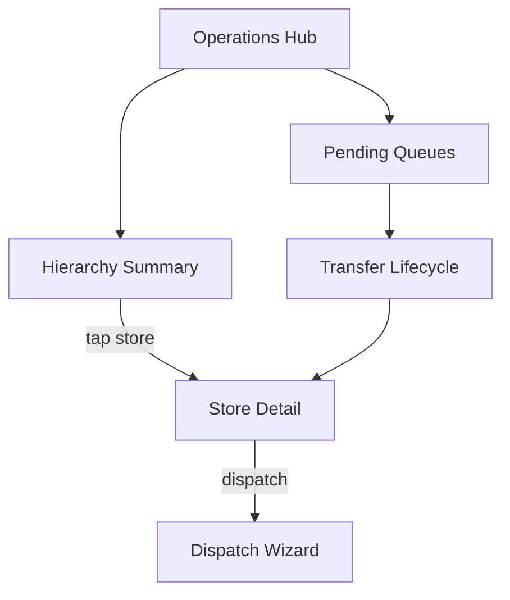

# Hierarchy Inventory -- Frontend Integration & UI Flow

**Audience:** Product managers, demo operators, frontend (Emergent) builders.

**API base:** `/api/v2/vendoremployee` (Bearer token = logged-in vendor employee)

**Backend reference:** [`api_implementation_status.md`](api_implementation_status.md)

**Prerequisite:** Route group `inventory-transfer` registered in [`routes/api/v2/api.php`](../routes/api/v2/api.php).

---

## Global concepts (all screens)

| Concept | UI meaning |
|---------|------------|
| **Actor restaurant** | Restaurant tied to login token (`vendoremployee.restaurant_id`). All queues and mutations use this unless "acting as" another store (see Screen 0). |
| **Visible tree** | Master: all centrals + franchises. Central: self + own franchises + sibling centrals + their franchises. Franchise: self only. |
| **Aggregate stock** | `inventory_master` -- list/summary quantities, low-stock flags. |
| **Batch ledger** | `inventory_stock_segments` -- batch, expiry, lineage; required for dispatch selection. |
| **Today default** | Summary/detail transactions default to **today** if no `from_date`/`to_date`. |
| **Franchise transactions** | Incoming only (`to_restaurant_id = self`). |

---

## Screen 0 -- Context / Acting-as selector

| Field | Value |
|-------|--------|
| **Purpose** | Show who the user is (master/central/franchise) and which restaurant context applies. Backend does **not** support impersonation: token always maps to one `restaurant_id`. "Acting as" = **navigate** to another visible store in reporting, not switch auth. |
| **APIs** | None dedicated. Optional: employee profile / restaurant metadata from existing vendoremployee profile APIs. Hierarchy visibility inferred from successful `hierarchy-summary` / `hierarchy-detail` responses. |
| **Main actions** | Display actor type badge (Master / Central / Franchise). For master/central: store picker populated from `hierarchy-detail` -> `data.restaurants` or summary `data.stores`. Franchise: lock picker to self. |
| **Role visibility** | Master/Central: multi-store picker. Franchise: read-only self. |
| **Important UI states** | **Locked context** (franchise). **Cross-branch** label when central views sibling central/franchise. **403** if user picks out-of-scope store id. |

---

## Screen 1 -- Operations Hub (home)

| Field | Value |
|-------|--------|
| **Purpose** | Entry dashboard: counts, shortcuts to pending work and hierarchy report. |
| **APIs** | `POST /inventory-transfer/pending-queues` -- badges for approval / receive / my requests. Optional: `POST /inventory-transfer/history` with `limit` for recent activity. |
| **Main actions** | Open Pending Approvals, Pending Receives, My Requests, Hierarchy Report, Direct Dispatch (parent only). |
| **Role visibility** | **Master/Central:** show approval + receive + dispatch shortcuts. **Franchise:** hide approval; show receive + request + my requests. |
| **Important UI states** | Empty queues ("No pending actions"). Badge counts from array lengths. Poll on focus / pull-to-refresh. |

---

## Screen 2 -- Hierarchy Summary (store list + day activity)

| Field | Value |
|-------|--------|
| **Purpose** | At-a-glance list of visible stores with **today's** (or ranged) sent/received/txn counts. First screen of **summary + detail** combo. |
| **APIs** | `POST /inventory-transfer/hierarchy-summary` |
| **Request body** | `{ "store_type": "central" \| "franchise", "from_date"?: "Y-m-d", "to_date"?: "Y-m-d" }` |
| **Main actions** | Toggle Central / Franchise tabs. Date: Today (default) / custom range. Tap row -> **Screen 3** with `store_restaurant_id`. Sort by low activity or name (client-side). |
| **Role visibility** | **Master:** both tabs, all visible stores per tab. **Central:** both tabs (includes siblings). **Franchise:** only franchise tab; typically one row (self); counts reflect **incoming-only** filter. |
| **Important UI states** | **Loading** skeleton. **Empty** visible set. **Date chip** "Today" vs range label. Per row: `sent_quantity`, `received_quantity`, `transaction_count`. |

---

## Screen 3 -- Store Detail (stock + transactions + drilldown)

| Field | Value |
|-------|--------|
| **Purpose** | Single-store operational view: aggregate stock, optional batch drilldown, transactions, dispatch entry for parents. Second half of summary + detail combo. |
| **APIs** | `POST /inventory-transfer/hierarchy-detail` (preferred). Alias: `POST /inventory-transfer/hierarchy-report` (same behavior). |
| **Request body** | Required: `store_restaurant_id`. Optional: `selected_stock_title` + `selected_unit_id` (both for batches), `transactions_stock_title`, `from_date`, `to_date`. |
| **Main actions** | Change store (picker from `data.restaurants`). View stock list (`child_stock_summary`). Tap item -> load batches (`child_stock_batches` + `parent_stock_batches`). Filter transactions by stock or date. **Dispatch** (if actor is parent of store) -> Screen 7. **Request stock** (if viewer is child) -> Screen 4. |
| **Role visibility** | **Master/Central:** any visible `store_restaurant_id`. **Franchise:** only own id; transactions incoming-only. **Parent batches** shown when actor can supply stock to selected child. |
| **Important UI states** | **Low stock** row highlight (`is_low_stock: true`). **Batch panel** hidden until stock selected. **Expired batches** not returned (already filtered server-side). **Empty transactions** for today. **403** out-of-scope store. |

---

## Screen 4 -- Request Stock (child -> parent)

| Field | Value |
|-------|--------|
| **Purpose** | Franchise or central requests items from parent. |
| **APIs** | `POST /inventory-transfer/request` / `POST /inventory-transfer/source-options` (optional) / `GET /inventory/get-inventory-master` (existing stock picker) |
| **Request body (request)** | Items with `quantity`, `unit`, `stock_title`/`unit_id` or `source_inventory_master_id`, and **`source_selector` required** per line (see Screen 8). |
| **Main actions** | Add lines, submit request, view status in **My Requests** (Screen 5). Edit while `requested`/`approved`: `POST /inventory-transfer/edit/{id}`. |
| **Role visibility** | **Franchise -> central parent.** **Central -> master parent.** Master does not request via this flow (uses dispatch). |
| **Important UI states** | **Validation 422** on missing selector. **Success** -> transfer id + `requested` status. Link to tracking in pending `my_requests`. |

---

## Screen 5 -- Pending Queues (action inbox)

| Field | Value |
|-------|--------|
| **Purpose** | Unified inbox for approve / receive / track own requests. |
| **APIs** | `POST /inventory-transfer/pending-queues` / Detail: `GET /inventory-transfer/details/{id}` |
| **Request body** | `{ "limit": 50 }` optional |
| **Main actions** | Tab: **Approval pending** -> Approve / Reject. **Receive pending** -> Receive / Reject (post-dispatch). **My requests** -> track status. Row tap -> Screen 9 Transfer Detail. |
| **Role visibility** | **Approval tab:** parent only (`approval_pending` non-empty for central/master). **Receive tab:** destination restaurant. **My requests:** requester (`to_restaurant_id = actor`). |
| **Important UI states** | Three lists from `approval_pending`, `receive_pending`, `my_requests`. `actions` object gives endpoint templates for buttons. Empty tab messaging. |

---

## Screen 6 -- Approve Request (parent)

| Field | Value |
|-------|--------|
| **Purpose** | Parent approves child request without moving stock yet. |
| **APIs** | `POST /inventory-transfer/approve/{id}` / `POST /inventory-transfer/reject/{id}` (pre-dispatch) / `GET /inventory-transfer/details/{id}` |
| **Main actions** | Approve -> enables dispatch. Reject with optional `resolution_type` / `resolution_meta`. |
| **Role visibility** | Actor must be `from_restaurant_id` on transfer. |
| **Important UI states** | Status `requested` -> `approved`. **409** already processed. Reject confirm dialog. |

---

## Screen 7 -- Dispatch (direct or from approved request)

| Field | Value |
|-------|--------|
| **Purpose** | Move stock from parent to child with **mandatory batch/segment selection**. |
| **APIs** | **Direct:** `POST /inventory-transfer/initiate` / **From request:** `POST /inventory-transfer/dispatch/{id}` / **Picker:** `POST /inventory-transfer/source-options` |
| **Request body (initiate)** | `from_restaurant_id`, `to_restaurant_id`, `items[]` each with `source_inventory_master_id`, `quantity`, `unit`, **`source_selector`** (`mode: segment_id`, `segment_id` OR `filter_bucket` for legacy). |
| **Main actions** | 1) Pick destination store (visible tree). 2) Pick item. 3) Call source-options. 4) User **must** pick segment row (or explicit legacy bucket). 5) Submit. |
| **Role visibility** | **Master -> central/franchise** (validated hierarchy). **Central -> own franchise** (and master->franchise rules per backend). |
| **Important UI states** | **No auto-FEFO** -- disable submit until segment selected. **LEGACY_SELECTOR_REQUIRED (422)** if segment_id used on null batch/expiry row -- show bucket picker instead. **INSUFFICIENT_STOCK (400)**. **STOCK_EXPIRED**. Segment list sorted FEFO in UI matching API order. |

---

## Screen 8 -- Source selector picker (modal / step)

| Field | Value |
|-------|--------|
| **Purpose** | Sub-UI for mandatory dispatch/request line selection. |
| **APIs** | `POST /inventory-transfer/source-options` -- body: `from_restaurant_id`, `source_inventory_master_id` |
| **Response usage** | `segments[]` (prefer `segment_id` rows). `filters` buckets for legacy. `is_fallback` / remainder rows with `segment_id: null` -> only bucket mode allowed. |
| **Main actions** | Select one segment row OR one filter bucket. Display batch, expiry, qty, `source_restaurant_id`. |
| **Role visibility** | Sender restaurant only (`from_restaurant_id` = actor). |
| **Important UI states** | **Expired hidden** server-side. **Legacy gap** -> hide segment tap, show "Non-batch bucket" only. Show `distinct_batches` / `distinct_expiry_dates` as filters if needed. |

---

## Screen 9 -- Transfer Detail (single transfer)

| Field | Value |
|-------|--------|
| **Purpose** | Full header + lines + timeline for one transfer. |
| **APIs** | `GET /inventory-transfer/details/{id}` / Optional `POST /inventory-transfer/history` for list context |
| **Main actions** | Contextual CTAs by status + role: Approve, Dispatch, Receive, Cancel, Reject, Edit. |
| **Role visibility** | Buttons gated by transfer flow matrix (see `api_implementation_status.md` Transfer Flow Table). |
| **Important UI states** | Status chips: `requested`, `approved`, `dispatched`, `received`, `partially_received`, `rejected`, `cancelled`, `on_hold`. Line-level receive progress if `meta_json` present. |

---

## Screen 10 -- Receive Stock (destination)

| Field | Value |
|-------|--------|
| **Purpose** | Destination confirms receipt; partial accept/reject supported. |
| **APIs** | `POST /inventory-transfer/receive/{id}` |
| **Request body** | Optional `received_lines[]` with `line_id`, `accepted_qty`, `rejected_qty`; optional `resolution_type`, `resolution_meta` |
| **Main actions** | Full receive or line-level partial. Rejection resolution drives restore behavior. |
| **Role visibility** | Actor = `to_restaurant_id`. |
| **Important UI states** | `dispatched` -> `received` / `partially_received`. **INVALID_RECEIVE_BREAKDOWN** if qty sum wrong. Post-receive: destination segments gain `source_restaurant_id` + `origin_transfer_id`. |

---

## Screen 11 -- Cancel / Reject (resolution)

| Field | Value |
|-------|--------|
| **Purpose** | Abort or dispute in-flight transfers with stock policy. |
| **APIs** | `POST /inventory-transfer/cancel/{id}` (source, dispatched) / `POST /inventory-transfer/reject/{id}` (source: requested/approved; destination: dispatched) |
| **Request body** | Optional `resolution_type`: `return_to_source` \| `damaged` \| `partial_return` \| `in_transit_hold` + `resolution_meta` |
| **Main actions** | Choose resolution, confirm, refresh queues. |
| **Role visibility** | See Cancel/Reject Caller Matrix in backend docs. |
| **Important UI states** | **Restore vs no restore** messaging per resolution. `on_hold` stops movement. |

---

## Screen 12 -- Batch / expiry drilldown (embedded in Store Detail)

| Field | Value |
|-------|--------|
| **Purpose** | Operational view of lots at a store for one SKU. |
| **APIs** | Driven by `hierarchy-detail` with `selected_stock_title` + `selected_unit_id` -> `child_stock_batches`; parent side `parent_stock_batches` for dispatch source. |
| **Main actions** | Sort FEFO (server order). Show `source_restaurant_id` on child batches. Tap parent batch -> pre-fill Screen 7 dispatch with that `segment_id`. |
| **Role visibility** | Child batches: selected store. Parent batches: only when actor is parent supplier. |
| **Important UI states** | **Near expiry** (client): expiry within N days -- highlight amber/red (compute from `expiry_date`). **No batch** null display as "Legacy / unbatched". |

---

## Screen 13 -- Low stock & alerts (embedded)

| Field | Value |
|-------|--------|
| **Purpose** | Flag items below min alert on store detail list. |
| **APIs** | `child_stock_summary[].is_low_stock`, `min_qty_alert` from `hierarchy-detail` |
| **Main actions** | Filter "Low stock only". Jump to request or dispatch. |
| **Role visibility** | All roles on stores they can view. |
| **Important UI states** | Sort already low-stock-first from API. Show unit-aware alert (kg/ltr vs gm/ml display). |

---

## Screen 14 -- Transaction timeline (embedded in Store Detail)

| Field | Value |
|-------|--------|
| **Purpose** | Day/range transfer activity for one store. |
| **APIs** | `hierarchy-detail` -> `transactions[]`; optional filter `transactions_stock_title`; date via `from_date`/`to_date` |
| **Main actions** | Default today. Expand row -> Screen 9. Filter incoming/outgoing (franchise: incoming only). |
| **Role visibility** | Master/Central: both directions. Franchise: incoming only. |
| **Important UI states** | Fields: `transfer_id`, `from_restaurant_id`, `to_restaurant_id`, `stock_title`, `quantity`, `status`, `created_at`. Empty today vs empty range. |

---

## Screen 15 -- Add stock (local replenishment)

| Field | Value |
|-------|--------|
| **Purpose** | Purchase/add stock with batch and future expiry at a site (creates/updates segments). |
| **APIs** | `POST /inventory/add-stock/{id}` / `GET /inventory/get-inventory-master` |
| **Main actions** | Enter qty, unit (normalize case in UI), batch, expiry **after today**, vendor, etc. |
| **Role visibility** | Per existing inventory permissions at logged-in restaurant. |
| **Important UI states** | **422** backdated expiry. Segment upsert after add. Feeds Screen 7 source-options. |

---

## Screen 16 -- Franchise push (admin / central ops)

| Field | Value |
|-------|--------|
| **Purpose** | Sync menu/recipes/stock metadata parent -> child (not transfer movement). |
| **APIs** | `POST /franchise/push/{id}` / Supporting franchise CRUD routes under `/franchise/*` |
| **Main actions** | Push bundle; review `_diagnostics.link_repair`. |
| **Role visibility** | Central/master managing franchise child. |
| **Important UI states** | Repush preserves child quantities. Consumption depends on `recipe_id` / `has_inventory`. |

---

## Recommended navigation flow (manager demo)

1. Login as **Central** -> Hub -> Pending queues (approve/receive).
2. **Hierarchy Summary** (`store_type: franchise`) -> pick franchise -> **Store Detail**.
3. On store: show **low stock** item -> **batch drilldown** -> **Dispatch** with segment picker.
4. Switch login to **Franchise** -> Hub -> **My requests** + **Receive pending** -> Receive with partial lines.
5. **Transactions** tab default **Today** -> open transfer detail.

---

## API quick reference (inventory-transfer)

| Endpoint | Method | Primary screen |
|----------|--------|----------------|
| `/inventory-transfer/pending-queues` | POST | 1, 5 |
| `/inventory-transfer/hierarchy-summary` | POST | 2 |
| `/inventory-transfer/hierarchy-detail` | POST | 3, 12, 13, 14 |
| `/inventory-transfer/request` | POST | 4 |
| `/inventory-transfer/approve/{id}` | POST | 6 |
| `/inventory-transfer/dispatch/{id}` | POST | 7 |
| `/inventory-transfer/initiate` | POST | 7 |
| `/inventory-transfer/source-options` | POST | 8 |
| `/inventory-transfer/receive/{id}` | POST | 10 |
| `/inventory-transfer/cancel/{id}` | POST | 11 |
| `/inventory-transfer/reject/{id}` | POST | 11 |
| `/inventory-transfer/edit/{id}` | POST | 4, 9 |
| `/inventory-transfer/details/{id}` | GET | 9 |
| `/inventory-transfer/history` | POST | 1, 9 |

---

## Frontend implementation notes (for Emergent)

- Do **not** call `hierarchy-report` for new UI; use **summary + detail**.
- Always send **both** `selected_stock_title` and `selected_unit_id` when loading batches.
- Dispatch: block submit until `source_selector` populated; handle `LEGACY_SELECTOR_REQUIRED` by switching to bucket UI.
- Franchise: label summary metrics clearly when incoming-only filter applies.
- "Acting as" = navigate with `store_restaurant_id` in detail API, not a separate auth token.
- Ensure `inventory-transfer` routes are registered on server before UAT.
